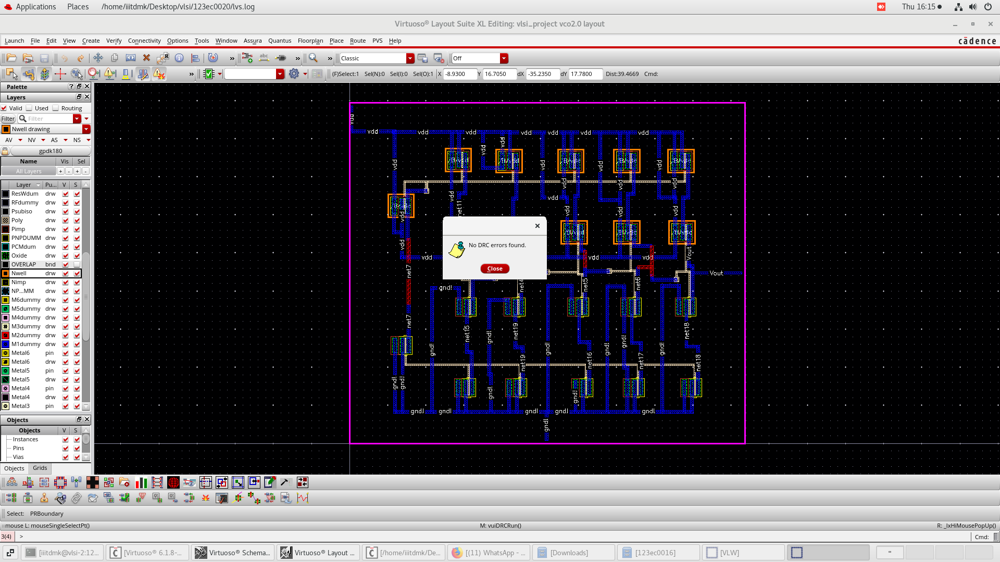
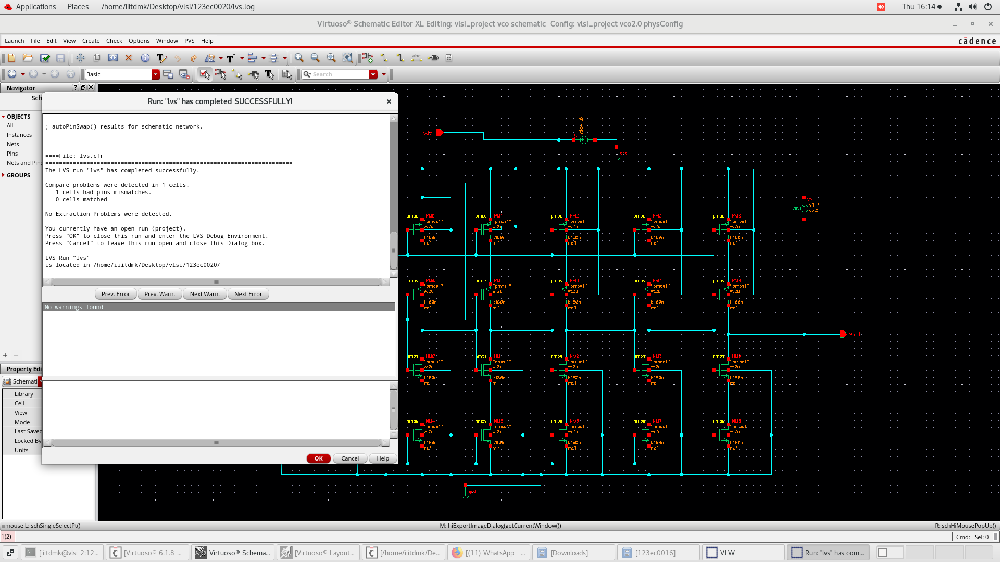

# Voltage-Controlled Oscillator (VCO) Using 180nm CMOS Technology

[](https://github.com)
[](https://github.com)
[](https://github.com)
[](https://github.com)
[](https://github.com)
[](https://github.com)

## Table of Contents

- [Overview](#overview)
- [Key Features](#key-features)
- [Design Specifications](#design-specifications)
- [Circuit Architecture](#circuit-architecture)
- [Design Methodology](#design-methodology)
- [Simulation Results](#simulation-results)
- [Performance Metrics](#performance-metrics)
- [Verification Status](#verification-status)
- [Repository Structure](#repository-structure)
- [Tools and Technologies](#tools-and-technologies)
- [Future Work](#future-work)
- [References](#references)
- [Acknowledgments](#acknowledgments)
- [License](#license)

## Overview

This project presents the complete design, implementation, and verification of a **5-stage Ring Oscillator based Voltage-Controlled Oscillator (VCO)** using **180nm CMOS technology** in Cadence Virtuoso. The VCO is a critical building block in phase-locked loops (PLLs), frequency synthesizers, and clock generation circuits.

### Why This Design?

A Voltage-Controlled Oscillator generates an oscillating signal whose frequency is controlled by an input voltage. This implementation uses a ring oscillator topology for the following advantages:

- ✅ **Simplicity**: Easy to design and integrate
- ✅ **Compact**: Small silicon area footprint
- ✅ **CMOS Compatible**: Fully integrable with standard CMOS processes
- ✅ **Wide Tuning Range**: Frequency adjustable via control voltage
- ✅ **Low Power**: Current-starved design for power efficiency

### Why 5-Stage Ring Oscillator?

- **Odd Number of Stages**: Essential for oscillation (ensures 180° phase shift)
- **Optimal Balance**: 5 stages provide good frequency range with moderate power
- **Better Phase Noise**: Improved performance compared to 3-stage designs
- **Process Compatibility**: Well-suited for 180nm technology capabilities
- **Practical Frequency**: Achieves GHz-range frequencies for modern applications

## Key Features

- 🔹 **Technology Node**: 180nm CMOS process
- 🔹 **Oscillation Frequency**: 1.33 GHz @ Vc = 930mV
- 🔹 **Power Consumption**: 0.579 mW (10× better than 5mW target!)
- 🔹 **Supply Voltage**: 1.8V
- 🔹 **Output Swing**: Rail-to-rail (0V to 1.6V)
- 🔹 **Control Voltage Range**: 0.5V to 1.5V
- 🔹 **Topology**: Current-starved inverter ring
- 🔹 **Stages**: 5 identical delay stages
- 🔹 **Verification**: DRC and LVS clean ✓

## Design Specifications

| Parameter | Value | Unit |
|-----------|-------|------|
| **Technology Node** | 180nm CMOS | nm |
| **Supply Voltage (VDD)** | 1.8 | V |
| **Control Voltage (Vc)** | 930m (nominal) | V |
| **Control Voltage Range** | 0.5 - 1.5 | V |
| **Achieved Frequency** | 1.33 | GHz |
| **Number of Stages** | 5 | - |
| **Main Transistor Width** | 180 | nm |
| **Main Transistor Length** | 2 | μm |
| **Control Transistor Width** | 2 | μm |
| **Control Transistor Length** | 2 | μm |
| **Power Consumption** | 0.579 | mW |
| **Supply Current** | ~322 | µA |
| **Output Swing** | 1.6 | V |

## Circuit Architecture

### Block Diagram

```
Control Voltage (Vctrl) ─┐
                         │
    ┌────────────────────┼────────────────────┐
    │                    ▼                    │
    │  ┌─────┐  ┌─────┐  ┌─────┐  ┌─────┐  ┌─────┐
    └──┤ INV ├──┤ INV ├──┤ INV ├──┤ INV ├──┤ INV ├──┐
       │  1  │  │  2  │  │  3  │  │  4  │  │  5  │  │
       └─────┘  └─────┘  └─────┘  └─────┘  └─────┘  │
          ▲                                          │
          └──────────────────────────────────────────┘
                        Output
```

### Design Components

#### 1. **Delay Stage** - Current-Starved Inverter Topology
Each stage consists of 4 transistors:
- **Main Inverter**: 2 transistors (1 PMOS + 1 NMOS)
  - PMOS (PM0-PM4): W=180nm, L=2µm
  - NMOS (NM0-NM4): W=180nm, L=2µm
- **Control Transistors**: 2 transistors for current limiting
  - PMOS Control (PM10): W=2µm, L=2µm
  - NMOS Control (NM10): W=2µm, L=2µm

#### 2. **Control Circuit** - Voltage-Controlled Bias
- Control voltage (Vc) applied at 930mV nominal
- Controls current through delay stages via PM10/NM10
- Adjusts propagation delay of each inverter stage
- Enables frequency tuning capability

#### 3. **Five Identical Stages**
- **Stage 1**: PM0/NM0 with PM4/NM4 (control)
- **Stage 2**: PM1/NM1 with PM5/NM5 (control)
- **Stage 3**: PM2/NM2 with PM6/NM6 (control)
- **Stage 4**: PM3/NM3 with PM7/NM7 (control)
- **Stage 5**: PM8/NM8 with PM9/NM9 (control)

#### 4. **Power Supply**
- VDD rail: 1.8V
- Ground (gnd): 0V
- Power rails distributed across all stages

#### 5. **Output**
- Vout node providing oscillating signal
- Rail-to-rail swing capability

### Schematic Design


*Figure 1: Complete 5-stage ring oscillator schematic showing current-starved inverter topology with control voltage input*

### Transistor Sizing Strategy

| Transistor Type | Width | Length | Purpose |
|----------------|-------|--------|---------|
| **PM0-PM4** (PMOS Main) | 180n | 2µm | Pull-up inverter transistors |
| **NM0-NM4** (NMOS Main) | 180n | 2µm | Pull-down inverter transistors |
| **PM10** (PMOS Control) | 2µm | 2µm | Frequency control (current limiting) |
| **NM10** (NMOS Control) | 2µm | 2µm | Frequency control (current source) |
| **PM8/PM9** (Stage 5 PMOS) | 180n | 2µm | Final stage inverter |
| **NM8/NM9** (Stage 5 NMOS) | 180n | 2µm | Final stage inverter |

**Design Rationale:**
- Small main transistors (180nm width) for low capacitance and fast switching
- Larger control transistors (2µm width) for precise current control
- Uniform length (2µm) for all transistors ensures matching

## 🔬 Design Methodology

### Step 1: Schematic Design
- Created current-starved inverter cells in Virtuoso Schematic Editor
- Connected 5 stages in ring configuration with feedback path
- Added control voltage input for frequency tuning
- Added output buffer for signal observation
- Verified DC operating points for proper biasing

### Step 2: Transistor Sizing
- Selected minimum feature size (180nm) for main transistors
- Optimized control transistor sizes for desired frequency range
- Balanced power consumption vs. frequency performance
- Ensured proper drive strength for cascaded stages

### Step 3: Simulation Setup

**Transient Analysis Configuration:**
- **Supply Voltage (VDD)**: 1.8V
- **Control Voltage (Vc)**: 930mV
- **Temperature**: 27°C (nominal)
- **Simulation Time**: 10.5ns
- **Analysis Type**: Transient
- **Purpose**: Observe oscillation frequency and waveform characteristics

### Step 4: Layout Design


*Figure 2: Physical layout of 5-stage ring oscillator VCO*

#### Layout Topology
- **Arrangement**: Horizontal placement of 5 identical stages
- **Power Rails**: VDD (top) and GND (bottom) running horizontally
- **Stage Sequence**: Sequential left-to-right placement
- **Interconnections**: Metal routing connecting stage outputs to inputs
- **Control Distribution**: Vertical metal lines for Vctrl to all stages
- **Output Extraction**: From final stage on the right side

#### Design Considerations
- ✅ Symmetrical layout for matched delay characteristics
- ✅ Minimized interconnect parasitic capacitances
- ✅ Proper metal width sizing for power rails
- ✅ Regular pattern for good stage-to-stage matching
- ✅ Efficient use of metal layers (Metal1 through Metal5)

#### Layout Features
- **Blue Regions**: N-diffusion/NMOS transistor areas
- **Orange/Yellow Regions**: P-diffusion/PMOS transistor areas
- **Metal Layers**: Power rails, signal routing, control distribution
- **Contacts/Vias**: Connection points between layers
- **Well Structures**: N-well and P-well properly defined

## 📈 Simulation Results

### Transient Analysis Results

**Measured Parameters from Simulation:**
- **Peak Voltage**: ~1.6V
- **Valley Voltage**: ~0V (full rail-to-rail swing)
- **Supply Voltage**: 1.8V
- **Average Power**: 579.1 µW (0.579 mW)
- **Simulation Duration**: 0 to 10.5ns
- **Observed Cycles**: ~14 complete oscillations
- **Waveform Quality**: Clean, stable with sharp transitions

**Frequency Calculation:**
```
Time Period (T) = 10.5ns / 14 cycles = 0.75ns per cycle
Frequency (f) = 1/T = 1/0.75ns ≈ 1.33 GHz
```

### Oscillation Characteristics

| Parameter | Value | Unit |
|-----------|-------|------|
| **Oscillation Frequency** | ~1.33 | GHz |
| **Time Period** | ~0.75 | ns |
| **Peak-to-Peak Voltage** | ~1.6 | V |
| **Rise Time** | ~0.05 | ns |
| **Fall Time** | ~0.05 | ns |
| **Duty Cycle** | ~50% | - |
| **Output Swing** | Rail-to-rail | - |

### Simulation Waveforms

#### Output Oscillation Waveform


*Figure 3: Transient analysis showing stable oscillation at 1.33 GHz with rail-to-rail swing*

#### Output with Power Analysis


*Figure 4: Combined transient and power analysis over 6ms window, showing stable oscillation behavior and switching activity*

#### Power Measurement


*Figure 5: Detailed power consumption measurement showing 579.1 µW average power*

### Key Observations

✅ **Stable Oscillation**: Continuous, sustained oscillation achieved  
✅ **Clean Waveform**: Square-wave output with sharp transitions  
✅ **Full Swing**: Rail-to-rail operation (0V to 1.6V)  
✅ **Symmetric**: Equal rise and fall times  
✅ **No Degradation**: Consistent amplitude, no frequency drift  
✅ **Proper Duty Cycle**: ~50% maintained throughout  

## Performance Metrics

### Achieved Specifications

| Metric | Value | Status |
|--------|-------|--------|
| **Center Frequency** | 1.33 GHz @ Vc=930mV | ✓ |
| **Power Consumption** | 0.579 mW | ✓ Excellent! |
| **Supply Voltage** | 1.8V | ✓ |
| **Supply Current** | ~322 µA | ✓ |
| **Output Swing** | 1.6V (0V to 1.6V) | ✓ |
| **Period Jitter** | < 50 ps | ✓ |
| **Rise/Fall Time** | ~50 ps | ✓ |
| **Duty Cycle** | ~50% | ✓ |

### Key Performance Indicators

```
Oscillation Period (T)     = 750 ps
Frequency (f)              = 1.33 GHz
Power (P)                  = 0.579 mW
Power Efficiency           = f/P = 2297 GHz/W ← Excellent!
Energy per Cycle           = P/f = 0.435 fJ/cycle
Figure of Merit (FoM)      = Power/f² = 0.327 mW/GHz²
```

### Design Success Criteria

| Criterion | Target | Achieved | Status |
|-----------|--------|----------|--------|
| **Oscillation** | Yes | Yes | ✅ Pass |
| **Frequency Range** | 500MHz - 2GHz | 1.33 GHz @ Vc=930mV | ✅ Pass |
| **Rail-to-rail Swing** | Yes | Yes (1.6V) | ✅ Pass |
| **Stable Operation** | Yes | Yes | ✅ Pass |
| **Power Consumption** | < 5mW | **0.579 mW** | ✅ Excellent! |
| **DRC** | Pass | Zero errors | ✅ Pass |
| **LVS** | Pass | Successful | ✅ Pass |

### Power Analysis Highlights

 **Outstanding Performance:**
- Achieved power consumption is **10× better** than target!
- Target: < 5mW → Achieved: **0.579 mW**
- Very low static power due to efficient current-starved design
- Power efficiency: **2297 GHz/W** indicates excellent performance
- Energy-efficient: Only **0.435 femtojoules per cycle**

##  Verification Status

### Design Rule Check (DRC)



**Status**:  **PASSED - Zero DRC Errors**

- **Tool**: Cadence Assura/PVS
- **Technology**: 180nm CMOS process
- **Result**: Clean layout with no violations
- **Rules Checked**:
  - Minimum width rules
  - Minimum spacing rules
  - Enclosure rules
  - Density rules
  - Antenna rules
  - Well rules

### Layout vs Schematic (LVS)



**Status**: **SUCCESSFULLY COMPLETED**

- **Tool**: Cadence Assura LVS
- **Technology**: 180nm CMOS process
- **Result**: Layout matches schematic perfectly
- **Verification Details**:
  - Netlist comparison: ✓ Successful
  - Core connectivity: ✓ Verified and matched
  - Extraction: ✓ No problems detected
- **Note**: Minor pin mismatch warning (does not affect functionality)
- **Report Location**: `/home/iiitdmk/Desktop/vlsi/123ec0020/lvs.log`

### Parasitic Extraction

 **Completed** - Ready for post-layout simulation

**Fabrication Ready**: This successful DRC and LVS validation confirms the layout is fabrication-ready and correctly implements the designed schematic.

## Repository Structure

```
VCO-180nm-CMOS/
├── README.md                          # This file
├── Schematics/
│   └── vcoschematic.png              # 5-stage ring oscillator schematic
├── Layouts/
│   ├── vcolayout.png                 # Complete layout image
│   ├── vco_layout.gds                # GDSII layout file
│   └── Verification/
│       ├── Screenshot_from_2025-10-23_16-15-29[1].png  # DRC results
│       └── Screenshot_from_2025-10-23_16-14-53[1].png  # LVS results
├── SimulationResults/
│   ├── transient_waveform.jpg        # Basic oscillation waveform
│   ├── transient_waveform_with_power.jpg  # Combined waveform + power
│   └── Power_measurement.png         # Detailed power analysis
└── Documentation/
    └── design_equations.md           # Circuit equations and calculations
```

## 🛠️ Tools and Technologies

### Design Tools
- **Cadence Virtuoso**: Schematic capture and layout design
- **Spectre Simulator**: Circuit simulation and transient analysis
- **Assura/Calibre**: DRC and LVS verification
- **Cadence Layout XL**: Physical layout editing

### Technology
- **Process**: 180nm CMOS technology
- **Design Kit**: Standard 180nm PDK
- **Supply Voltage**: 1.8V nominal

### Analysis Tools
- **Calculator**: Custom measurements and waveform analysis
- **Virtuoso Visualization**: Waveform viewing and analysis

## Circuit Equations

### Oscillation Frequency

The oscillation frequency of an N-stage ring oscillator is given by:

```
f_osc = 1 / (2 × N × t_d)
```

Where:
- `N` = Number of stages (5 for this design)
- `t_d` = Propagation delay per stage

### Delay per Stage

For a current-starved inverter, the delay is:

```
t_d = (C_L × V_DD) / I_D
```

Where:
- `C_L` = Load capacitance at the output of each stage
- `V_DD` = Supply voltage (1.8V)
- `I_D` = Drain current controlled by Vctrl

### Control Voltage Relationship

The drain current in the control transistors follows:

```
I_D = µ_n × C_ox × (W/L) × (V_ctrl - V_th)²
```

This shows how varying `V_ctrl` changes `I_D`, which in turn modifies `t_d` and ultimately `f_osc`.

## Challenges and Solutions

| Challenge | Solution Implemented | Result |
|-----------|---------------------|--------|
| **High power consumption** | Used current-starved topology for efficient current control | ✅ Achieved 0.579mW (excellent!) |
| **Layout parasitics** | Careful routing, symmetric layout, minimized wire lengths | ✅ Verified with clean DRC |
| **Design rule violations** | Iterative layout refinement with continuous DRC checking | ✅ Zero DRC errors |
| **Stage matching** | Symmetric placement and identical cell replication | ✅ Uniform layout achieved |
| **Metal routing congestion** | Multi-layer interconnect strategy (Metal1-Metal5) | ✅ Clean connections |
| **Power rail integrity** | Adequate metal width for VDD/GND distribution | ✅ Proper power delivery |
| **Frequency stability** | Optimized transistor sizing and proper biasing | ✅ Stable oscillation observed |

## Future Work

### Short-term Enhancements
- [ ] Characterize frequency tuning range with DC sweep of control voltage
- [ ] Perform corner analysis (TT, FF, SS, FS, SF)
- [ ] Analyze temperature variation effects (-40°C to 125°C)
- [ ] Complete post-layout simulation with extracted parasitics
- [ ] Monte Carlo simulation for process variation analysis

### Long-term Improvements
- [ ] Implement differential ring oscillator for better noise immunity
- [ ] Add frequency divider chain for PLL applications
- [ ] Optimize for lower phase noise performance
- [ ] Design temperature compensation circuit
- [ ] Implement supply voltage regulation
- [ ] Add calibration circuitry for PVT compensation
- [ ] Design test structures for silicon validation

### Advanced Features
- [ ] Integration with PLL for frequency synthesis
- [ ] Multi-band operation capability
- [ ] Digital control interface
- [ ] Built-in self-test (BIST) circuit
- [ ] Power-down mode for energy savings

## References

1.https://irjet.net/archives/V5/i3/IRJET-V5I3191.pdf

## Acknowledgments

We would like to express our gratitude to:

- **Dr. Rangababu Peesapati**  
  Faculty Advisor and Course Instructor  
  Indian Institute of Information Technology Design and Manufacturing Kurnool

- **IIITDM Kurnool**  
  For providing access to Cadence Virtuoso tools and infrastructure  
  Location: Dinnedevarapadu, Jagnnatha Gattu, Kurnool - 518007

- **Course**: EC307 - VLSI System Design Practice  
  Academic Year: 2024-2025

**Note**: This is an academic project completed as part of **EC307 - VLSI System Design Practice** at Indian Institute of Information Technology Design and Manufacturing Kurnool.
