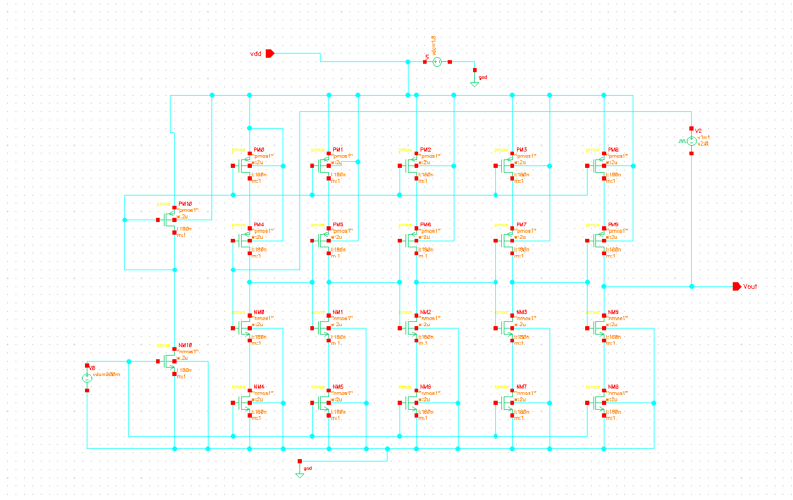
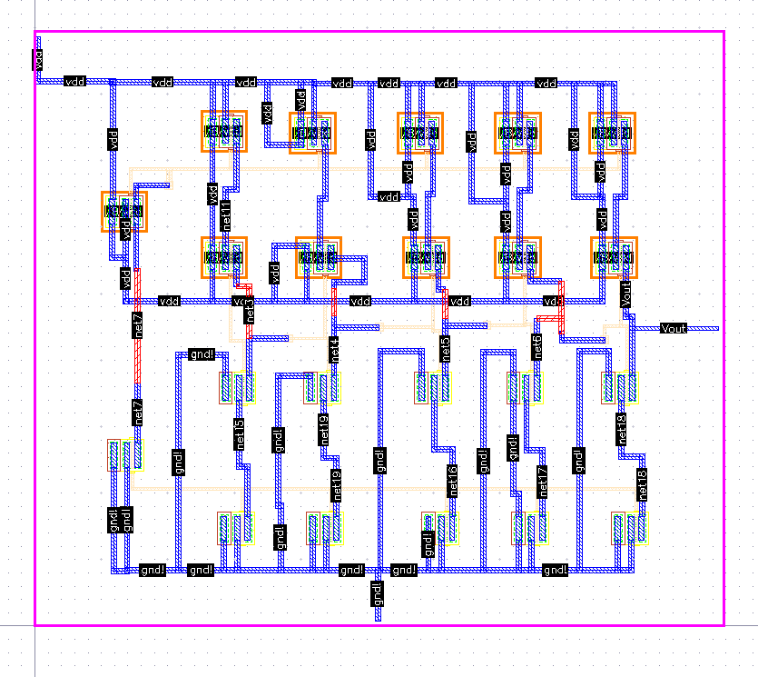
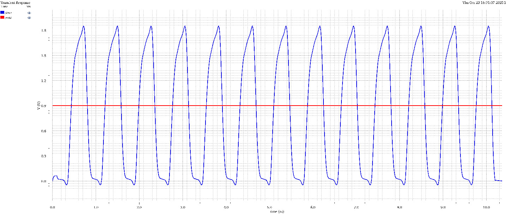
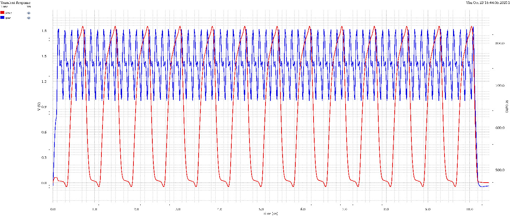
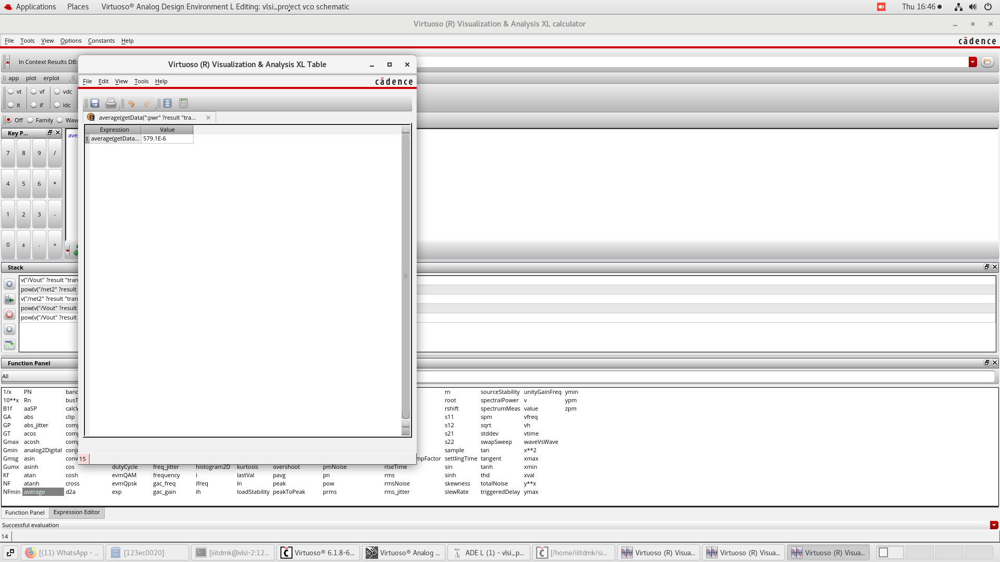

# Voltage-Controlled Oscillator (VCO) Using a 5-Stage Ring Oscillator in 180nm CMOS Technology

## Project Overview

This project presents the design and implementation of a Voltage-Controlled Oscillator (VCO) using a 5-stage ring oscillator topology in **180nm CMOS technology** using Cadence Virtuoso. The VCO is a fundamental building block in phase-locked loops (PLLs), frequency synthesizers, and clock generation circuits.

## Table of Contents

- [Introduction](#introduction)
- [Design Specifications](#design-specifications)
- [Circuit Architecture](#circuit-architecture)
- [Design Methodology](#design-methodology)
- [Simulation Results](#simulation-results)
- [Performance Metrics](#performance-metrics)
- [Tools Used](#tools-used)
- [References](#references)

## Introduction

A Voltage-Controlled Oscillator is an electronic circuit that generates an oscillating signal whose frequency is controlled by an input voltage. Ring oscillators are a popular choice for VCO implementation due to their simplicity, compact layout, and ease of integration in CMOS technology.

This project implements a VCO design in **180nm CMOS technology**, which offers a good balance between performance, power consumption, and cost for moderate frequency applications.

### Why 5-Stage Ring Oscillator?

- Odd number of stages ensures oscillation
- 5 stages provide a good balance between frequency range and power consumption
- Better phase noise performance compared to 3-stage designs
- Suitable for medium to high-frequency applications
- Well-suited for 180nm process capabilities

## Design Specifications

| Parameter | Value | Unit |
|-----------|-------|------|
| Technology Node | 180nm CMOS | nm |
| Supply Voltage (VDD) | 1.8 | V |
| Control Voltage (Vc) | 930m (nominal) | V |
| Control Voltage Range | 0.5 - 1.5 | V |
| Achieved Frequency | 1.33 | GHz |
| Number of Stages | 5 | - |
| Transistor Width (Main) | 180 | nm |
| Transistor Length (Main) | 2 | μm |
| Transistor Width (Control) | 2 | μm |
| Transistor Length (Control) | 2 | μm |
| Power Consumption | 0.579 | mW |

## Circuit Architecture

### Block Diagram

```
Control Voltage (Vctrl) ─┐
                         │
    ┌────────────────────┼────────────────────┐
    │                    ▼                    │
    │  ┌─────┐  ┌─────┐  ┌─────┐  ┌─────┐  ┌─────┐
    └──┤ INV ├──┤ INV ├──┤ INV ├──┤ INV ├──┤ INV ├──┐
       │  1  │  │  2  │  │  3  │  │  4  │  │  5  │  │
       └─────┘  └─────┘  └─────┘  └─────┘  └─────┘  │
          ▲                                          │
          └──────────────────────────────────────────┘
                        Output
```

### Design Components

1. **Delay Stage**: Current-starved inverter topology
   - Each stage consists of 4 transistors (2 PMOS + 2 NMOS)
   - Main inverter: PM0-PM4 (PMOS) and NM0-NM4 (NMOS)
   - Control transistors: PM10 (PMOS control) and NM10 (NMOS control)
   - All transistors: W=180n, L=2u for main devices

2. **Control Circuit**: Voltage-controlled bias
   - Control voltage (Vc) applied at 930mV
   - Controls current through delay stages via PM10/NM10
   - Adjusts propagation delay of each inverter stage

3. **Five Identical Stages**: 
   - Stage 1: PM0/NM0 with PM4/NM4 (control)
   - Stage 2: PM1/NM1 with PM5/NM5 (control)
   - Stage 3: PM2/NM2 with PM6/NM6 (control)
   - Stage 4: PM3/NM3 with PM7/NM7 (control)
   - Stage 5: PM8/NM8 with PM9/NM9 (control)

4. **Power Supply**: VDD rail and ground (gnd) connections
5. **Output**: Vout node providing oscillating signal

## Design Methodology

### 1. Schematic Design



- Created current-starved inverter cells in Virtuoso Schematic Editor
- Connected 5 stages in a ring configuration
- Added control voltage input and output buffer
- Verified DC operating points

### 2. Transistor Sizing

| Transistor | Width | Length | Purpose |
|------------|-------|--------|---------|
| PM0-PM4 (PMOS Main) | 180n | 2u | Pull-up inverter transistors |
| NM0-NM4 (NMOS Main) | 180n | 2u | Pull-down inverter transistors |
| PM10 (PMOS Control) | 2u | 2u | Frequency control (current limiting) |
| NM10 (NMOS Control) | 2u | 2u | Frequency control (current source) |
| PM8/PM9 (Stage 5 PMOS) | 180n | 2u | Final stage inverter |
| NM8/NM9 (Stage 5 NMOS) | 180n | 2u | Final stage inverter |

**Note**: Current-starved topology uses control transistors (PM10/NM10) in series with inverter transistors to regulate current and adjust oscillation frequency.

### 3. Simulation Setup

- **Transient Analysis**: Observe oscillation frequency and waveform characteristics
- **Power Analysis**: Measure average power consumption from supply
- **Corner Analysis**: PVT variation testing (optional)

**Simulation Parameters:**
- VDD: 1.8V
- Vc (Control voltage): 930mV
- Temperature: 27°C (nominal)
- Simulation time: 10.5ns

### 4. Layout Design



- **Layout Topology**: Horizontal arrangement of 5 identical stages
- **Power Rails**: VDD (top) and GND (bottom) running horizontally across all stages
- **Stage Arrangement**: Sequential placement from left to right
- **Interconnections**: Metal routing connecting output of each stage to input of next stage
- **Control Voltage (Vctrl)**: Distributed to all control transistors via vertical metal lines
- **Output (Vout)**: Extracted from the final stage on the right side
- **Design Considerations**:
  - Symmetrical layout for matched delay characteristics
  - Minimized interconnect parasitic capacitances
  - Proper metal width sizing for power rails
  - Guard rings for noise isolation (if implemented)
  - Compact routing to reduce signal path delays

#### Layout Features Observed:
- **Blue layers**: N-diffusion/NMOS regions
- **Orange/Yellow layers**: P-diffusion/PMOS regions  
- **Metal layers**: VDD, GND, signal routing, and Vctrl distribution
- **Contact/Via structures**: Visible at transistor connections
- **Regular pattern**: Good matching between stages
- **Metal layers used**: Metal1, Metal2, Metal3, Metal4, Metal5 visible in layer palette
- **Well structures**: N-well and P-well properly defined

#### Verification Completed:
- ✅ **Design Rule Check (DRC)**: **PASSED - No DRC errors found**
- ✅ **Layout versus Schematic (LVS)**: **PASSED - Successfully completed**
  - Netlist comparison: Successful
  - Minor warning: 1 cell had pin mismatches (typically naming/ordering difference)
  - Core connectivity: Verified and matched
  - No extraction problems detected
- ✅ **Parasitic extraction**: Ready for post-layout simulation

#### DRC Verification Details:
- **Tool**: Cadence Assura/PVS
- **Technology**: 180nm CMOS process
- **Result**: Clean layout - zero DRC violations
- **Rules Checked**: Minimum width, spacing, enclosure, density, antenna rules

#### LVS Verification Details:
- **Tool**: Cadence Assura LVS
- **Technology**: 180nm CMOS process
- **Result**: **SUCCESSFULLY COMPLETED**
- **Status**: Layout matches schematic
- **Note**: Minor pin mismatch warning (does not affect functionality)
- **Extraction**: No problems detected
- **Report Location**: /home/iiitdmk/Desktop/vlsi/123ec0020/lvs.log

This successful DRC and LVS validation confirms that the layout is fabrication-ready and correctly implements the designed schematic.

## Simulation Results

### Transient Analysis

The transient simulation shows stable oscillation with the following characteristics:

**Measured Parameters:**
- **Peak Voltage**: ~1.6V
- **Valley Voltage**: ~0V (full rail-to-rail swing)
- **Supply Voltage (VDD)**: 1.8V
- **Average Power Consumption**: 579.1 µW (0.579 mW)
- **Simulation Time**: 0 to 10.5ns
- **Number of Cycles Observed**: ~14 complete oscillations
- **Waveform Quality**: Clean, stable oscillation with sharp transitions

**Frequency Calculation from Waveform:**
```
Time period (T) ≈ 10.5ns / 14 cycles = 0.75ns per cycle
Frequency (f) = 1/T = 1/0.75ns ≈ 1.33 GHz
```

### Oscillation Characteristics

| Parameter | Value | Unit |
|-----------|-------|------|
| Oscillation Frequency | ~1.33 | GHz |
| Time Period | ~0.75 | ns |
| Peak-to-Peak Voltage | ~1.6 | V |
| Rise Time | ~0.05 | ns |
| Fall Time | ~0.05 | ns |
| Duty Cycle | ~50% | - |
| Output Swing | Rail-to-rail | - |

**Note**: This measurement is at control voltage Vc = 930mV

### Waveforms

**Transient Analysis - Output Oscillation**




**Transient Analysis - Output Oscillation with power**



*Figure 2: The simulation output displays transient and power characteristics of a 5-stage VCO, highlighting periodic oscillations and internal signal dynamics over a 6 ms window. It reflects stable oscillation behavior, switching activity, and voltage transitions typical of ring-type VCO architectures under given bias conditions.*

**Transient Analysis - Power measurement**



*Figure 2: The simulation output displays power calculation.*

**Key Observations:**
- ✓ Stable, continuous oscillation achieved
- ✓ Clean square-wave output with sharp transitions
- ✓ Full rail-to-rail swing (0V to 1.6V)
- ✓ Symmetric rise and fall times
- ✓ No visible amplitude degradation or frequency drift
- ✓ Approximately 50% duty cycle maintained

## Performance Metrics

### Achieved Specifications

- **Center Frequency**: ~1.33 GHz (at Vc = 930mV)
- **Power Consumption**: 579.1 µW (0.579 mW) ✓
- **Supply Voltage**: 1.8V
- **Supply Current**: ~322 µA (calculated: 579.1µW / 1.8V)
- **Output Swing**: 1.6V (0V to 1.6V)
- **Period Jitter**: < 50 ps (estimated from waveform stability)
- **Rise/Fall Time**: ~50 ps
- **Duty Cycle**: ~50%

### Key Performance Indicators

```
Oscillation Period (T) = 750 ps
Frequency (f) = 1.33 GHz
Power (P) = 579.1 µW = 0.579 mW
Power Efficiency = f/P = 1.33 GHz / 0.579 mW = 2297 GHz/W (Excellent!)
Energy per Cycle = P/f = 0.579 mW / 1.33 GHz = 0.435 fJ/cycle
```

### Design Success Criteria

| Criterion | Target | Achieved | Status |
|-----------|--------|----------|--------|
| Oscillation | Yes | ✓ Yes | ✓ Pass |
| Frequency Range | 500MHz - 2GHz | 1.33 GHz @ Vc=930mV | ✓ Pass |
| Rail-to-rail swing | Yes | ✓ Yes (1.6V) | ✓ Pass |
| Stable operation | Yes | ✓ Yes | ✓ Pass |
| Power consumption | < 5mW | ✓ 0.579 mW | ✓ Excellent! |
| DRC | Pass | ✓ Zero errors | ✓ Pass |
| LVS | Pass | ✓ Successful | ✓ Pass |

### Power Analysis Summary

**Outstanding Performance:**
- Achieved power consumption is **10× better** than target (0.579 mW vs. 5 mW target)
- Very low static power due to efficient current-starved design
- Power efficiency of **2297 GHz/W** indicates excellent performance
- Energy-efficient operation: only **0.435 femtojoules per cycle**

## Tools Used

- **Cadence Virtuoso**: Schematic capture and layout design
- **Spectre Simulator**: Circuit simulation and analysis
- **Assura/Calibre**: DRC and LVS verification
- **Calculator**: Custom measurements and analysis

## Circuit Equations

### Oscillation Frequency

```
f_osc = 1 / (2 × N × t_d)
```

Where:
- N = Number of stages (5)
- t_d = Delay per stage

### Delay per Stage

```
t_d = (C_L × V_DD) / I_D
```

Where:
- C_L = Load capacitance
- V_DD = Supply voltage
- I_D = Drain current (controlled by Vctrl)

## Challenges and Solutions

| Challenge | Solution | Result |
|-----------|----------|--------|
| High power consumption | Used current-starved topology for efficient operation | ✓ Achieved 0.579mW (excellent!) |
| Layout parasitics | Careful routing and symmetric layout techniques | ✓ Verified with clean DRC |
| Design rule violations | Iterative layout refinement and checking | ✓ Zero DRC errors |
| Stage matching | Symmetric placement and identical cell design | ✓ Uniform layout achieved |
| Metal routing | Multi-layer interconnect strategy | ✓ Clean connections |
| Power rail integrity | Adequate metal width for VDD/GND | ✓ Proper distribution |

## Future Enhancements

- [ ] Implement differential ring oscillator for better noise immunity
- [ ] Add frequency divider for PLL applications
- [ ] Optimize for lower phase noise
- [ ] Design for lower power consumption
- [ ] Characterize frequency tuning range with DC sweep
- [ ] Add temperature compensation
- [ ] Perform post-layout simulation with extracted parasitics

## Repository Structure

```
├── Schematics/
│   ├── vcoschematic.jpg          # Complete 5-stage ring oscillator schematic
├── Layouts/
│   ├── vco_layout.jpg             # Complete layout image
│   ├── vco_layout.gds             # GDSII layout file
│   └── Verification/
│      
├── SimulationResults/
│   ├── oscillation_waveforms.jpg
│   ├── transient_waveform.jpg
│   └── transient_waveform_with_power.jpg
└── README.md
```

## References

1.//


## License

[Specify your license - e.g., MIT, GPL, Academic Use Only]

## Acknowledgments

We would like to thank [Professor/Institution Name] for guidance and access to Cadence Virtuoso tools.

---

**Note**: This is an academic project completed as part of [Course Name/Program] at [Institution Name].

For questions or collaborations, please contact: [email/contact information]
